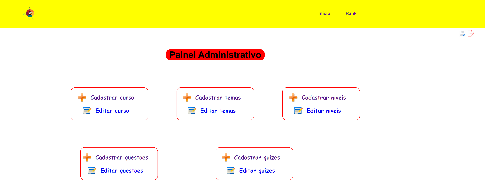

# Statistical Lab (SLab)




## Como rodar o ambiente para desenvolvimento?

Entre dentro da pasta `bin` e emita o comando.

**ATENÇÃO**: este comando acima deve ser executado com o seu usuário normal (**não root**).

```console
./configurar_ambiente_dev.sh
```

Em seguida execute o comando:

```console
sudo ./slab.sh dev
```

Pronto! Agora você já pode fazer edições nos códigos do SLab e acessá-lo em [localhost:3000](http://localhost:3000).

## Como iniciar o ambiente em produção?

Entre dentro da pasta `bin` e emita o comando:

```console
sudo ./slab.sh prod
```

Pronto! O sistema subirá os containers que são necessários para a execução e você poderá acessá-lo em [localhost:3000](http://localhost:3000).
